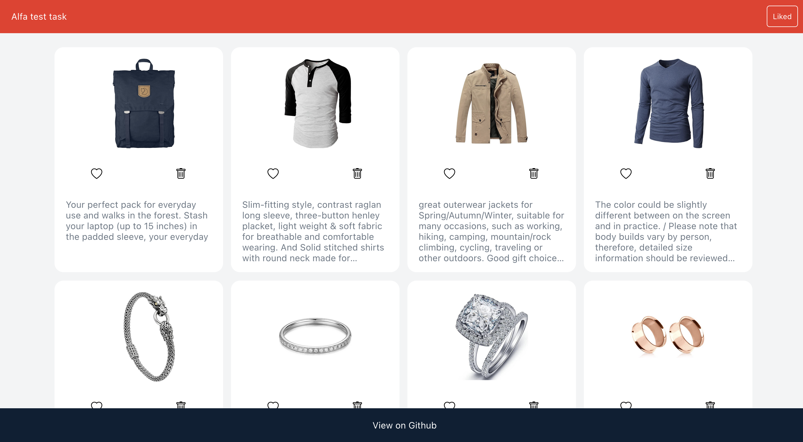
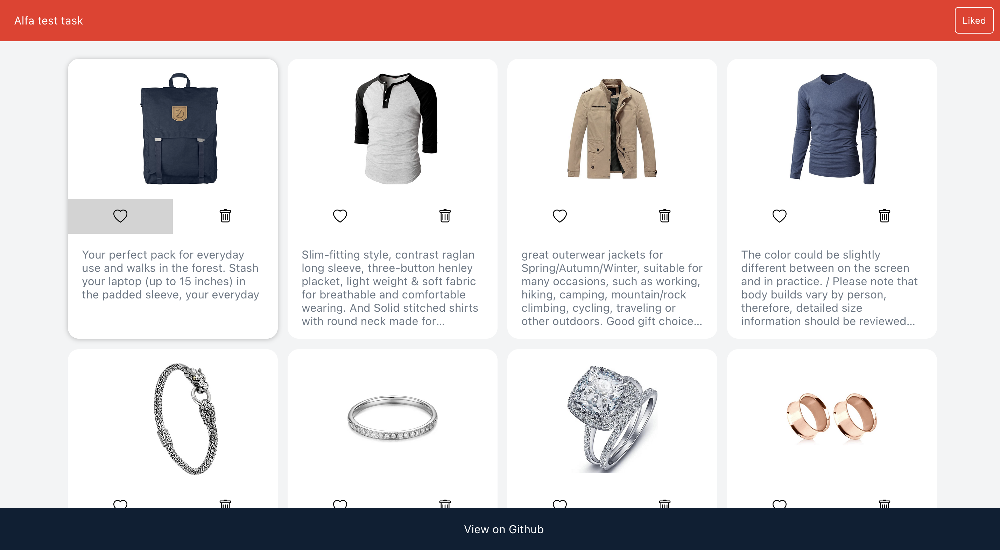
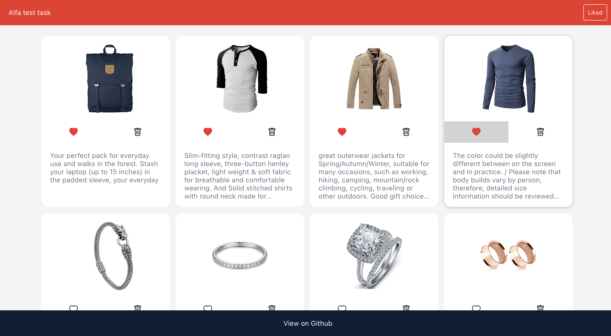
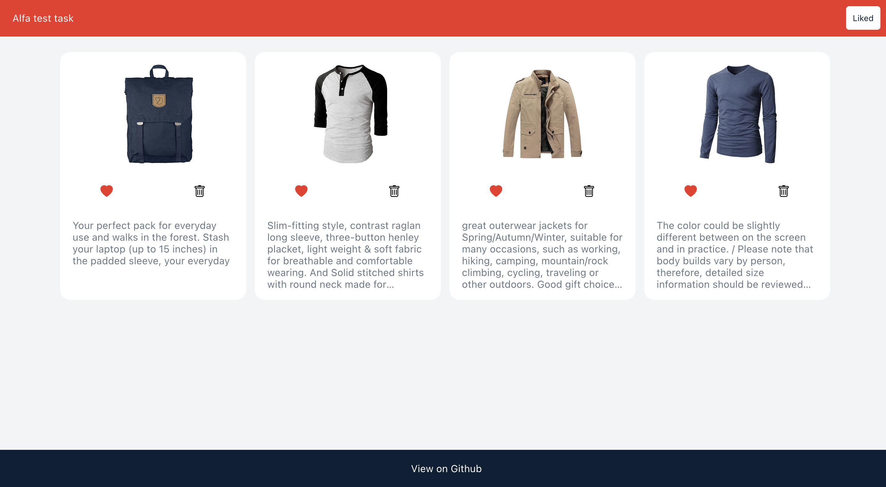
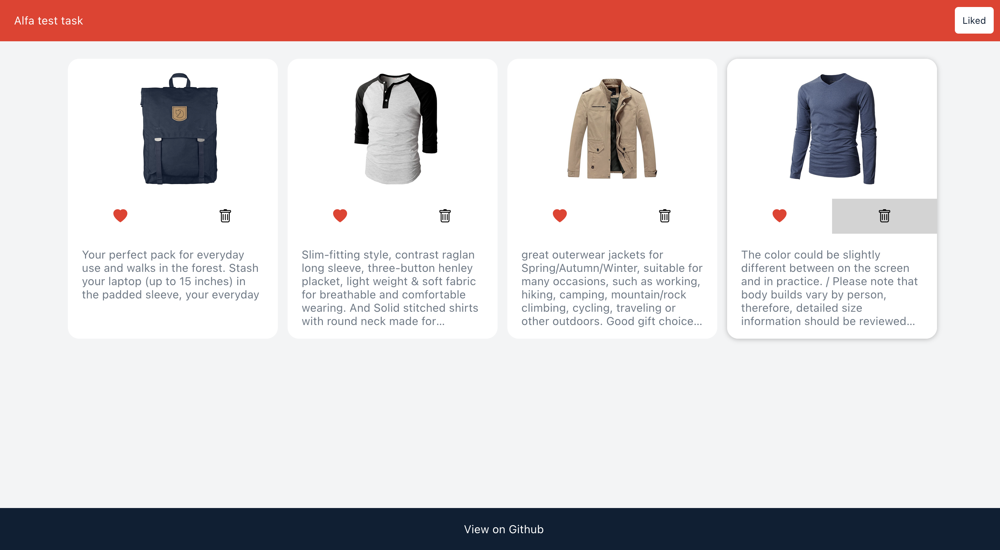
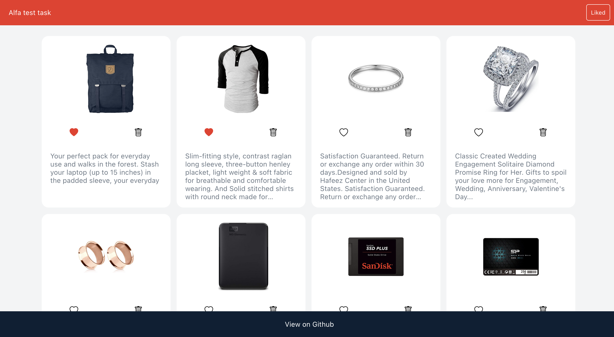

# Тестовое задание в Альфа-банк

## Для запуска
### `npm start`

[http://localhost:3000](http://localhost:3000) чтобы просмотреть в браузере.

## Для сборки проекта
### `npm run build`

Собирается в папку `build` в кореневой папке.

## Технологический стек

- React
- Redux
- Redux-Saga
- Styled-components
- TypeScript

## Скриншоты

### Начальный экран
Загрузка может занять какое-то время, проверить, что запрос происходит можно посмотреть в devtools.

### Нажатие на лайк

### Пролайкано какое-то количество

### Просмотр пролайканых

### Удаление элементов(опять же, может занять время, так как происходит запрос на сервер для эмуляции реального удаления)

### Удалены два элемента и выполнен переход ко всем карточкам

